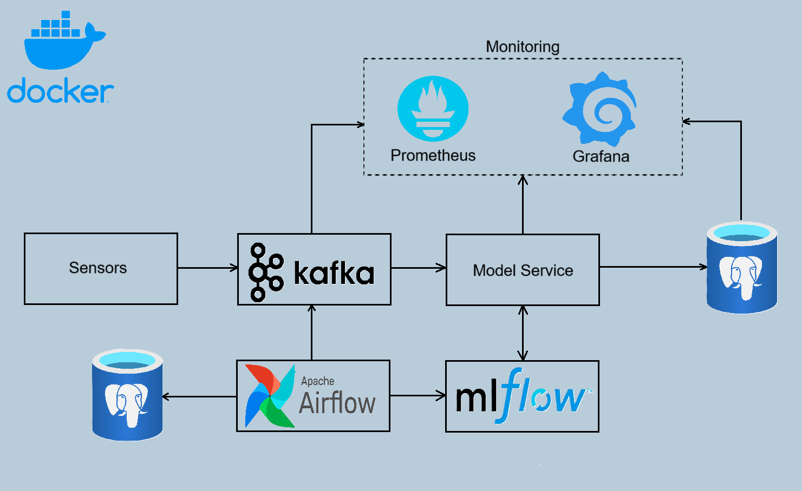

# Anomaly detection in an IoT setting (stream processing)
## About

This project implements an end-to-end pipeline for real-time anomaly detection in sensor data using:

- **Flask** – REST API server
- **Apache Kafka** – streaming simulation of sensor stations
- **Apache Airflow** - orchestrates model drift detection and retraining
- **Scikit-learn** – model training with Isolation Forest
- **MLflow** – model tracking and versioning
- **Prometheus + Grafana** – monitoring and metrics visualization
- **Docker + Docker Compose** – containerized deployment

## Architecture


**Frontend**\
Sensor simulators act as the data-producing front-end, continuously generating simulated sensor data (temperature, humidity, sound). These messages are sent to a Kafka topic for asynchronous, high-throughput ingestion.

**Backend API**\
 The Model Service, built with Flask, acts as the back-end prediction service. It:

- Consumes sensor data from Kafka in real-time.

- Loads the latest production model from MLflow Model Registry.

- Makes anomaly predictions on incoming data.

- Stores predictions into a PostgreSQL database.

- Exposes Prometheus-compatible metrics (e.g., anomaly count, model scores) via HTTP.

**Asynchronous Messaging**\
Kafka is used as a message broker for asynchronous data ingestion, enabling decoupling between data producers and the anomaly detection pipeline. 

**Model Inference & Monitoring**\
The Flask service performs inference using a deployed ML model. It tracks predictions, anomaly scores, and metrics like active anomalies using Prometheus. These metrics are visualized in Grafana and can be used for alerting or monitoring model health over time.

**Model Lifecycle & Tracking**\
MLflow is used for full experiment tracking, model versioning, and registry, ensuring reproducibility and auditability of all models. Apache Airflow orchestrates model retraining and drift detection workflows.

**Database**\
PostgreSQL is used to store both Airflow metadata and prediction results, ensuring a consistent and durable storage layer for orchestration and analytics.

**Prometheus & Grafana**\
Prometheus scrapes metrics from the Flask service (via a /metrics endpoint) to monitor model health. Grafana connects to Prometheus as a datasource and visualizes model health.

##  Prerequisites

- Docker & Docker Compose
- Python 3.11+

## Usage

1. **Clone the repo:**

```git clone https://github.com/AnastasiaShvydkaiia/Anomaly-detection-in-an-IoT-setting.git```

```cd anomaly-detection```

2. **Start the system:**

```docker-compose up --build```

3. **Access:**

- Prometheus: http://localhost:9090

- Grafana: http://localhost:3000 (admin/admin)

- MLflow UI: http://localhost:5000

- Airflow UI: http://localhost:8080 (admin/admin)

- Metrics endpoint: http://localhost:8000/metrics


4. **Stop**

```docker-compose down -v```

## Conclusion

The project successfully demonstrated a scalable anomaly detection system trained on real industrial sensor data (from Kaggle), integrated into a simulated factory streaming environment. The system is portable, easily monitorable, and ready for adaptation to real-time industrial applications once live data is available